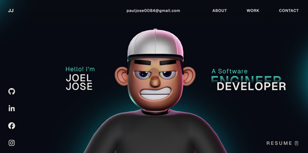

# 🌐 My Portfolio Website

  

A modern, responsive portfolio website showcasing my projects, skills, and experience as a Software Engineer. Built with a focus on performance, smooth animations, and clean UI.

---

## 📌 Overview

This project represents my personal portfolio where I highlight:
- 💼 Professional experience  
- 🧠 Technical skills  
- 🛠️ Featured projects  
- 📬 Contact information  

The goal of this portfolio is to present my work in an interactive and visually appealing way while maintaining strong performance and scalability.

---

## ⚙️ Tech Stack

- **Frontend:** React, TypeScript  
- **Animations:** GSAP  
- **3D & Graphics:** Three.js, WebGL  
- **Styling:** HTML, CSS, JavaScript  
